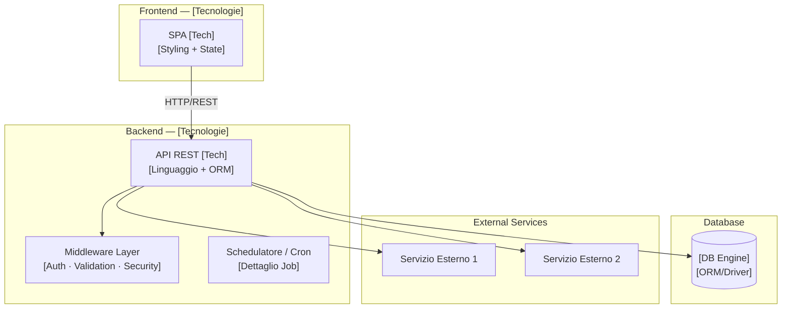
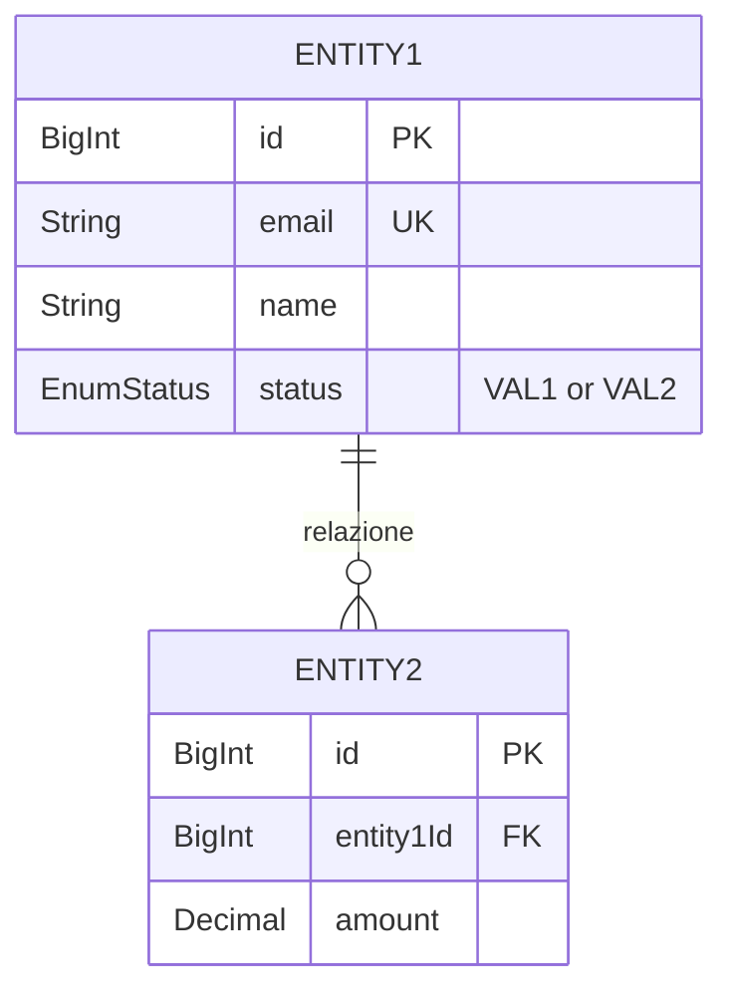
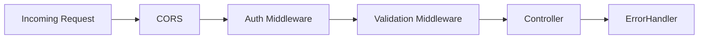
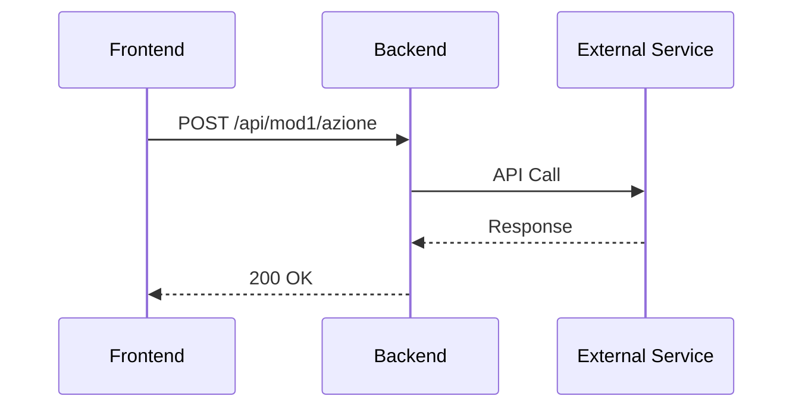

# 🏗️ [Nome Progetto] — Architettura AS-IS (Parte 1)

> **Documento tecnico per review con Dev Team, PM e Tecnici**
> Generato il: [DATA] | Versione: [VERSIONE]

---

## 1. Overview di Sistema

*Fornire un diagramma di blocco dettagliato delle interazioni tra Frontend, Backend, Database e Servizi Esterni.*



---

## 2. Tech Stack

*Compilare una tabella esaustiva con tutti i componenti tecnologici dell'applicazione e le loro versioni.*

| Layer | Tecnologia | Versione | Descrizione / Scopo |
|-------|-----------|----------|---------------------|
| **Frontend** | [es. React] | [versione] | [Scopo] |
| **State Mgmt** | [es. Zustand] | [versione] | [Scopo] |
| **Styling** | [es. TailwindCSS] | [versione] | [Scopo] |
| **Backend** | [es. Express] | [versione] | [Scopo] |
| **ORM** | [es. Prisma] | [versione] | [Scopo] |
| **Database** | [es. MySQL] | [versione] | [Scopo] |
| **Auth** | [es. JWT] | — | [Scopo] |
| **Validation** | [es. Zod] | [versione] | [Scopo] |

---

## 3. Database Schema (ER Diagram)

*Elencare le entità principali del database con i loro campi, tipi e relazioni grafiche in formato Mermaid ERD.*



---

## 4. Backend Architecture

### 4.1 Struttura Directory
*Rappresentare graficamente la struttura ad albero delle directory del backend.*

```
backend/src/
├── server.ts              # Entry point
├── controllers/           # Request handlers
├── services/              # Business logic
├── middleware/            # Custom middleware
├── lib/                   # Singletons / External clients
├── validations/           # Schema validation (Zod/Joi)
└── prisma/                # Database schema & migrations
```

### 4.2 Middleware Pipeline
*Rappresentare graficamente la pipeline sequenziale attraversata da una richiesta HTTP.*



### 4.3 Gestione Errori
*Spiegare la gerarchia di errori ed inserire il formato standard di risposta in caso di fallimento.*

```json
{
  "status": "error",
  "code": "ERROR_CODE",
  "message": "Human readable message"
}
```

---

## 5. API Reference Completa

### 5.1 [Modulo 1] (`/api/mod1`)

---

#### `POST /api/mod1/azione`
**Scopo:** [Descrizione dettagliata dell'azione]
**Middleware:** [Elenco dei middleware applicati]

**Request Body:**
```json
{
  "field1": "value",
  "field2": 123
}
```

**Response 200:**
```json
{
  "success": true,
  "data": {
    "id": "1",
    "createdAt": "2026-05-27T00:00:00.000Z"
  }
}
```

**Flusso interno (se complesso):**


**Errori:**
| Code | Messaggio | Descrizione |
|------|-----------|-------------|
| 400 | `VALIDATION_ERROR` | Campi mancanti o invalidi |
| 401 | `UNAUTHORIZED` | Token non valido o scaduto |
