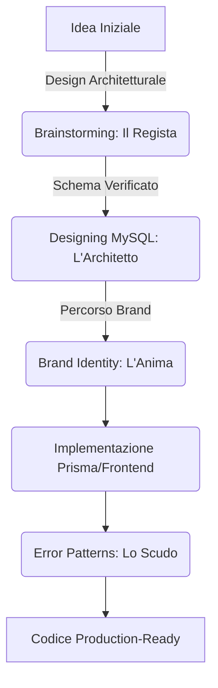

# 🚀 MasterAgents Ecosystem

Benvenuto nel cuore pulsante del tuo assistente AI. Questo ecosistema è composto da un set di **skill agentiche interconnesse**, progettate per guidarti dall'ideazione pura alla produzione di codice professionale, scalabile e brandizzato.
Utilizzale in Google Antigravity

## 🧭 Il "Master Path" (Flusso Ideale)

Questo è l'ordine logico per avviare con successo ogni nuovo progetto o feature:

---

## 🚀 Guida Rapida: Inizializzazione Progetto

Se stai iniziando un progetto da zero, segui questi **3 Step Fondamentali** con precisione:

### Step 1: Brainstorming & Tech Stack
Definisci cosa stiamo costruendo e su quale stack.
- **Prompt:** *"Inizia la skill **brainstorming** per [Tua Idea]. Definiamo i requisiti e confermiamo lo stack tecnologico in `brand-identity/resources/tech-stack.md`."*
- **Azione Manuale:** Puoi modificare manualmente `tech-stack.md` se hai preferenze specifiche (es. cambiare database o framework) prima di procedere.

### Step 2: Configurazione Brand Identity
Senza un'identità chiara, l'agente non può generare UI o testi coerenti. Esistono due scenari primari:

#### Scenario A: Hai un manuale di Brand (PDF/Doc)
- **Prompt:** *"Usa la skill **brand-identity** per analizzare questo PDF allegato [Allega File]. Estrai colori, font e tono di voce e aggiorna automaticamente i file `resources/design-tokens.json` e `voice-tone.md`."*

#### Scenario B: Hai solo informazioni sparse (Colori, Logo, Idea)
- **Prompt:** *"Configura la mia **brand-identity**: il colore primario è #FF5733, il font desiderato è 'Inter' e il tono di voce deve essere 'Tecnico ma amichevole'. Aggiorna i design token e la guida vocale."*

### Step 3: Architettura Dati (MySQL)
Progetta il database prima di scrivere una singola riga di codice applicativo.
- **Prompt:** *"Avvia la skill **designing-mysql-tables** per il progetto. Seguiamo i 7 step procedurali partendo dallo Step 0. Salva i progressi in `ideas/[nome-progetto].md`."*

---

## 🛠️ Skill Directory

| Skill | Ruolo | Quando Invocare | Deliverable Principale |
| :--- | :--- | :--- | :--- |
| **`brainstorming`** | **Il Regista** | All'inizio di ogni feature. | Documento di design in `docs/plans/` |
| **`designing-mysql-tables`** | **L'Architetto** | Dopo il brainstorming. | Schema fisico e file in `ideas/` |
| **`brand-identity`** | **L'Anima** | Per UI/UX e coerenza stack. | `design-tokens.json` e `tech-stack.md` |
| **`error-patterns`** | **Lo Scudo** | In fase di sviluppo logica. | Codice resiliente (Circuit Breaker, etc.) |

---

## 📂 Gestione Risorse: Cosa modificare a mano?

Per garantire che l'agente lavori sempre con le informazioni corrette, ecco come gestire i file in `.agent/skills/`:

| File | Modifica Manuale? | Descrizione |
| :--- | :--- | :--- |
| `tech-stack.md` | ✅ **Consigliata** | Modificalo all'inizio del progetto per "blindare" le tecnologie che l'agente deve usare. |
| `voice-tone.md` | ⚠️ **Opzionale** | Lascia che l'agente lo popoli tramite prompt/PDF, modificalo solo per affinamenti stilistici. |
| `design-tokens.json`| 🤖 **Agente** | È meglio farlo aggiornare all'agente per garantire la validità del formato JSON. |
| `ideas/` | ❌ **No** | Questa cartella è il "diario di bordo" dell'agente per la progettazione DB. |

---

## 💡 Libreria di Prompt Avanzati

### Configurazione Brand (Dettagliata)
- *"Analizza i miei esadecimali #1A1A1A (primario) e #00FF00 (accento). Aggiorna la **brand-identity** creando una scala di colori coerente in `design-tokens.json`."*
- *"Il mio brand è 'MasterAgents'. Il tono di voce deve essere ispirato a una guida sicura e autoritaria ma visionaria. Aggiorna `voice-tone.md`."*

### Implementazione Cross-Skill
- *"Implementa la pagina di Login. Consulta **brand-identity** per i colori e i font, e usa **error-patterns** per gestire correttamente i fallimenti di autenticazione (es. lockout, brute force)."*

---
*Ultimo aggiornamento: Gennaio 2026*