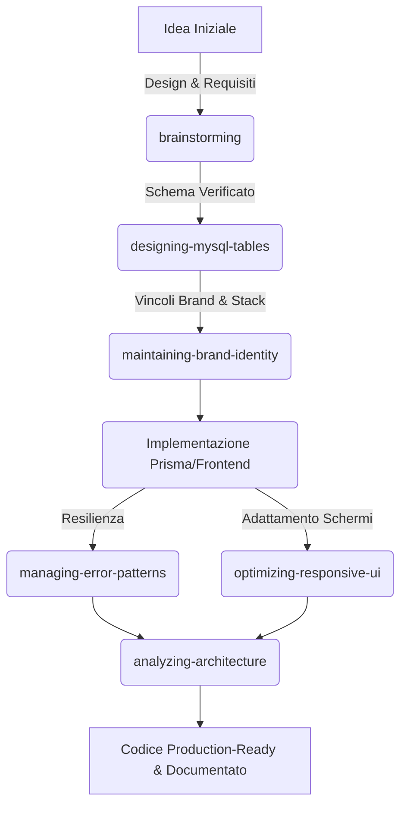

# 🚀 Webisales2 — Ecosistema Skill Agentiche

Questo repository usa un set di **skill Claude Code interconnesse** (`.claude/skills/`), progettate per guidare l'agente dall'ideazione alla produzione di codice coerente con lo stack, il brand e i pattern di errore del progetto.

Le skill si attivano **automaticamente** quando il contesto della richiesta combacia con la loro descrizione — i prompt qui sotto sono pensati per innescarle in modo esplicito e affidabile, ma non sono obbligatori.

---

## 🧭 Il "Master Path" (Flusso Ideale per Nuove Feature)

```mermaid
graph TD
    User[Idea Iniziale] -->|Design & Requisiti| Director(brainstorming)
    Director -->|Schema Verificato| Architect(designing-mysql-tables)
    Architect -->|Vincoli Brand & Stack| Soul(maintaining-brand-identity)
    Soul --> Implementation(Implementazione Prisma/Frontend)
    Implementation -->|Resilienza| Shield(managing-error-patterns)
    Implementation -->|Adattamento Schermi| Responsive(optimizing-responsive-ui)
    Shield --> Docs(analyzing-architecture)
    Responsive --> Docs
    Docs --> Production[Codice Production-Ready & Documentato]
```

---

## 🛠️ Skill Directory

| Skill | Ruolo | Quando si attiva | Deliverable Principale |
| :--- | :--- | :--- | :--- |
| **`brainstorming`** | Il Regista | Prima di ogni feature nuova o modifica di comportamento | Documento di design in `docs/plans/YYYY-MM-DD-<topic>-design.md` |
| **`designing-mysql-tables`** | L'Architetto | Nuove tabelle, colonne, modifiche allo schema | Schema fisico + file in `.claude/skills/designing-mysql-tables/ideas/` |
| **`maintaining-brand-identity`** | L'Anima | UI, copy, scelte di stack/librerie | `design-tokens.json`, `tech-stack.md`, `voice-tone.md` |
| **`managing-error-patterns`** | Lo Scudo | Implementazione logica, gestione fallimenti | Codice con gerarchia `AppError` (Retry, Circuit Breaker, ecc.) |
| **`optimizing-responsive-ui`** | Il Sarto | Problemi di layout, breakpoint, mobile | Componenti corretti + report responsive |
| **`analyzing-architecture`** | Il Cronista | Documentazione tecnica as-is, dopo modifiche rilevanti | `architecture_part1.md` / `architecture_part2.md` |

---

## 📂 Gestione Risorse: Cosa modificare a mano?

| File | Modifica Manuale? | Note |
| :--- | :--- | :--- |
| `.claude/skills/maintaining-brand-identity/resources/tech-stack.md` | ✅ Consigliata | Blinda le tecnologie fin dall'inizio del progetto |
| `.claude/skills/maintaining-brand-identity/resources/voice-tone.md` | ⚠️ Opzionale | Meglio farlo popolare all'agente da prompt/PDF, poi affinare a mano |
| `.claude/skills/maintaining-brand-identity/resources/design-tokens.json` | 🤖 Solo Agente | Per garantire JSON sempre valido |
| `.claude/skills/designing-mysql-tables/ideas/` | ❌ No | È il "diario di bordo" dell'agente per il DB — non editare a mano |
| `.claude/skills/managing-error-patterns/resources/exception-hierarchy-design.md` | ✅ Se cambia la gerarchia errori reale nel codice | Deve restare sincronizzato col codice, non il contrario |
| `CLAUDE.md` (root) | ✅ Sì | Mappa generale del progetto, va tenuto aggiornato manualmente |

---

## 💬 Prompt per Continuare il Progetto

Questa è la sezione che userai più spesso: prompt pronti per ogni tipo di intervento sulla codebase esistente. Sono scritti per far scattare la skill giusta senza doverla nominare esplicitamente — ma puoi sempre nominarla se preferisci essere diretto.

### Riprendere/orientarsi nel progetto
> *"Analizza lo stato attuale del progetto: leggi `CLAUDE.md`, la struttura di `App/`, e lo schema Prisma. Dammi un riepilogo di cosa è già implementato prima di procedere."*

### Aggiungere una nuova feature
> *"Voglio aggiungere [descrizione feature]. Iniziamo dal brainstorming per definire requisiti e design prima di scrivere codice."*

Segue automaticamente `brainstorming` → eventualmente `designing-mysql-tables` se serve nuovo schema → `maintaining-brand-identity` per UI/copy → `managing-error-patterns` per la logica.

### Correggere un bug
> *"C'è un bug: [descrizione comportamento errato]. Analizza il codice coinvolto, identifica la causa e proponi un fix coerente con la gestione errori esistente (gerarchia `AppError`)."*

Per bug legati a layout/responsive, specifica: *"...è un problema di responsive su [pagina/breakpoint]"* per far scattare `optimizing-responsive-ui`.

### Aggiungere colonne o tabelle al DB
> *"Devo aggiungere [colonna/tabella] a [tabella esistente] per supportare [motivo]. Usa la skill designing-mysql-tables partendo dallo Step 0, tenendo conto dello schema Prisma attuale — è un aggiornamento, non uno schema da zero."*

### Modificare una feature esistente
> *"Voglio modificare [feature] per fare invece [nuovo comportamento]. Controlla prima come è implementata oggi, poi proponi il design della modifica."*

### Aggiornare la documentazione architetturale
> *"Ho modificato [integrazione/endpoint/tabella]. Aggiorna `architecture_part1.md`/`part2.md` con un'analisi differenziale rispetto alla versione esistente."*

### Migliorare resilienza/gestione errori su codice esistente
> *"Rivedi la gestione errori in [file/modulo] usando la checklist di managing-error-patterns. Segnala dove mancano eccezioni tipizzate o retry appropriati."*

### Refactor UI/brand su componenti esistenti
> *"Rivedi [componente/pagina] per assicurarti che colori, font e testi seguano maintaining-brand-identity. Segnala eventuali scostamenti dai design token."*

---

## 💡 Prompt Avanzati (Configurazione Iniziale — solo per nuovi progetti/reset)

### Configurazione Brand da PDF
> *"Usa maintaining-brand-identity per analizzare `brandbook.pdf` nella root. Estrai colori, font e tono di voce e aggiorna `resources/design-tokens.json` e `resources/voice-tone.md`."*

### Configurazione Brand da info sparse
> *"Configura maintaining-brand-identity: colore primario #FF5733, font 'Inter', tono di voce 'Tecnico ma amichevole'. Aggiorna i design token e la guida vocale."*

### Prompt cross-skill (esempio completo)
> *"Implementa la pagina di Login. Consulta maintaining-brand-identity per colori e font, usa managing-error-patterns per gestire i fallimenti di autenticazione (lockout, brute force), e verifica con optimizing-responsive-ui che sia usabile da mobile."*

---

## ⚠️ Regole Ferme (vedi anche `CLAUDE.md`)

- Nessuna migrazione DB automatica: solo proposte DDL testuali da approvare
- Nessuna modifica a `.env` o segreti
- Nessun commit diretto su `main` senza conferma esplicita
- Path nei file di skill sempre relativi, mai assoluti
- Nomi delle classi di errore (`AppError`, `ValidationError`, `NotFoundError`, `NetworkError`, `DatabaseError`) fissi — non introdurne varianti

---
*Ultimo aggiornamento: Luglio 2026*