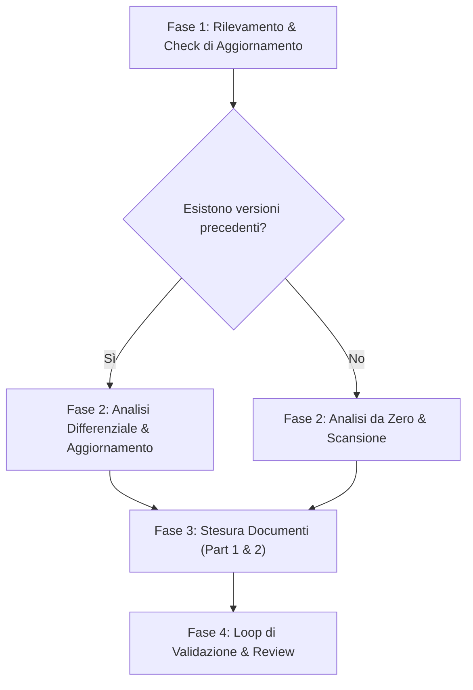

# 🏗️ Analyzing Architecture System Instructions

Questa skill guida l'agente nell'eseguire o aggiornare un'analisi tecnica profonda dell'architettura di un'applicazione (AS-IS). Produce documentazione tecnica ad altissima fedeltà strutturata esattamente come i file di riferimento storici, garantendo la massima precisione su database, endpoint API, flussi d'integrazione e frontend.

## When to use this skill
- Quando l'utente chiede di mappare o documentare l'architettura tecnica del sistema.
- Quando si aggiungono o modificano integrazioni critiche (servizi esterni, gateway di pagamento) e occorre documentarne i flussi.
- Quando si aggiorna lo schema del database o la pipeline delle API e bisogna aggiornare la documentazione esistente.
- Quando l'utente chiede esplicitamente di generare documenti "architecture_part1.md" e "architecture_part2.md".

---

## Workflow

L'agente deve seguire rigorosamente questo processo in 4 fasi:

### Checklist di Esecuzione
- [ ] **Fase 1: Rilevamento & Check di Aggiornamento**
  - Elencare le cartelle in `docs/architecture/` (formato `<DD-MM-YYYY>/`): la più recente è la
    base per l'analisi differenziale. Se la cartella è vuota o assente, si parte da zero.
- [ ] **Fase 2: Analisi Tecnica (CodeGraph-first, mai grep/find a tappeto)**
  - `codegraph status` e `codegraph files` in ogni lato indicizzato: la struttura dei file e
    l'inventario di rotte/simboli si leggono dal grafo, non dal filesystem.
  - Per i flussi critici (auth, webhook, integrazioni transazionali): spawnare **Explore agent**
    con `codegraph_explore` sul lato pertinente, uno per flusso o area — mai chiamare
    `codegraph_explore` nella sessione principale. Per i flussi cross-stack, un'esplorazione per
    lato.
  - **ERD**: si ricava dallo schema DB reale (Prisma: `schema.prisma`, letto direttamente — il
    grafo non indicizza i modelli).
  - **Se Aggiornamento**: confrontare i vecchi documenti con l'output del grafo (nuovi endpoint,
    modifiche a schema, nuovi store, nuovi hook) e mappare le discrepanze.
- [ ] **Fase 3: Stesura dei Documenti (Split in 2 Parti)**
  - Generare la documentazione dividendo l'output in due parti per evitare limitazioni di dimensione dei file e mantenere la leggibilità.
  - Utilizzare i template in `examples/` per garantire lo stesso identico livello di precisione tecnica, schemi JSON e diagrammi Mermaid.
- [ ] **Fase 4: Validazione & Review**
  - Verificare che tutti gli endpoint abbiano request/response completi (no placeholder come `...`).
  - Verificare la validità della sintassi di tutti i diagrammi Mermaid (usare doppi apici per stringhe speciali).
  - Assicurarsi che i percorsi dei file usino lo slash `/` come separatore.

---

## Deep Technical Guidelines & Output Requirements

L'agente non deve mai produrre descrizioni astratte o generiche. La documentazione prodotta deve rispettare i seguenti standard di profondità tecnica:

### 1. Rappresentazione Grafica (Mermaid)
- **Overview di Sistema**: Diagramma di blocco (`graph TB`) che mostra l'interazione tra i moduli frontend, backend, database e tutti i servizi o API esterne.
- **Database ERD**: Schema entità-relazione completo (`erDiagram`) che elenca campi, chiavi primarie/esterne, relazioni (es. `||--o{`) e tipi di dato.
- **Flussi Sequenziali**: Diagrammi di sequenza (`sequenceDiagram`) dettagliati per flussi critici (autenticazione, webhook, integrazioni transazionali multi-step).

### 2. Dettaglio delle API (Reference Completa)
Ogni endpoint documentato deve includere obbligatoriamente:
- **Metodo e Path** (es. `POST /api/<entita>/:id/sync`).
- **Scopo e Middleware associati**.
- **Request Payload** completo in formato JSON valido.
- **Response Payload (Successo 200/201)** completo con tutti i campi tipizzati.
- **Tabella degli errori** mappando gli HTTP Code e le stringhe dei codici d'errore applicativi
  (fonte: la gerarchia reale documentata in `managing-error-patterns`).

### 3. Pipeline di Integrazione Esterna
Mappare ogni passo delle chiamate REST esterne con diagrammi di sequenza dedicati che mostrano:
- payload esatti inviati all'API di terze parti.
- gestione dello stato e log di database associati (es. log di integrazione `PROCESSING` -> `SUCCESS`/`ERROR`).
- comportamento in caso di fallimenti parziali (mancanza di rollback automatici, etc.).

### 4. Architettura Frontend
Delineare con tabelle e strutture ad albero:
- **Routing**: Tabella delle pagine con i relativi guard/layout applicati.
- **State Management**: Nomi degli store Zustand e loro esatto scopo.
- **Data Fetching**: Tutti gli hook custom React Query indicando l'endpoint associato, il metodo e il comportamento di caching.
- **Services Layer**: Struttura dei file di servizio Axios e impostazione degli interceptor (es. gestione del 401).

---

## Handoff

- **Input atteso**: una modifica consegnata a integrazioni/schema/API (tipicamente a valle di
  un'implementazione), oppure richiesta esplicita di documentare l'as-is.
- **Output prodotto**: `docs/architecture/<DD-MM-YYYY>/architecture_part1.md` + `_part2.md`,
  con tabella errori per endpoint (codici dalla gerarchia di
  [`managing-error-patterns`](../managing-error-patterns/SKILL.md)).
- **Prossima skill**: nessuna — è il capolinea della pipeline. Ciò che l'analisi rivela come
  mancante o incoerente diventa input per un nuovo giro di `brainstorming`.

## Resources & Templates
- [Template Parte 1](examples/architecture_template_part1.md)
- [Template Parte 2](examples/architecture_template_part2.md)
