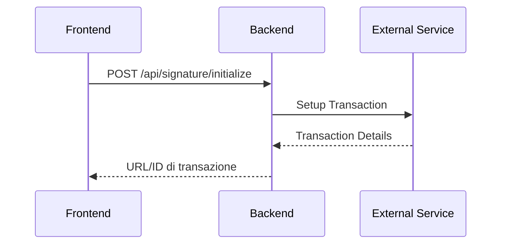
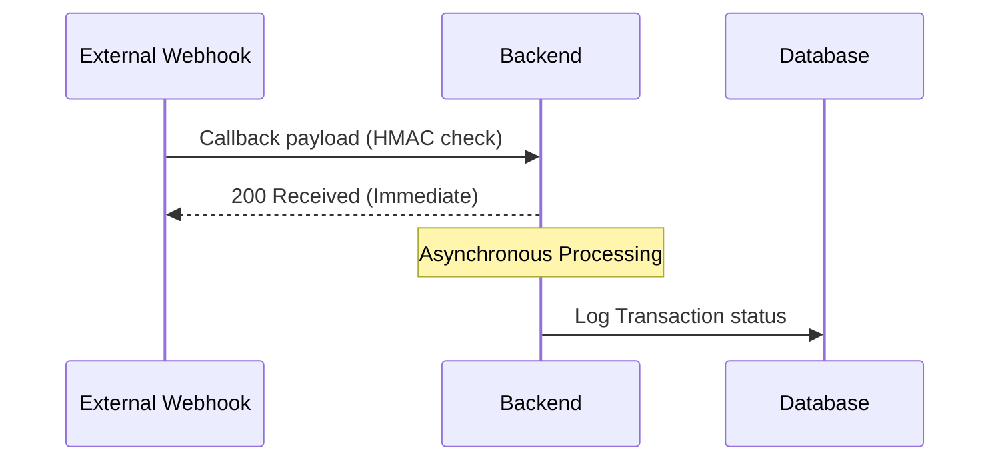
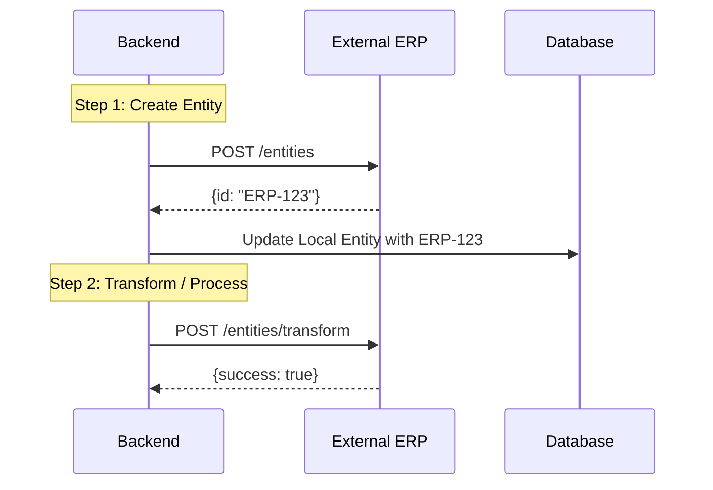
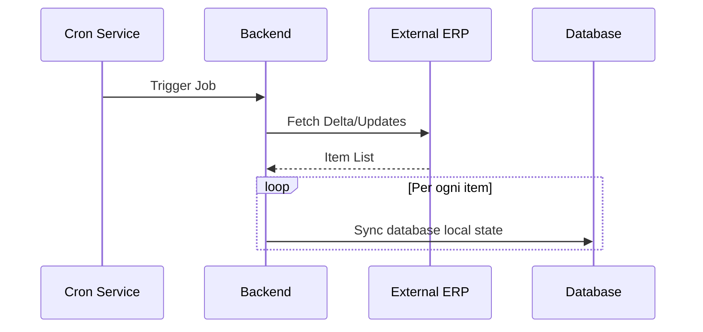
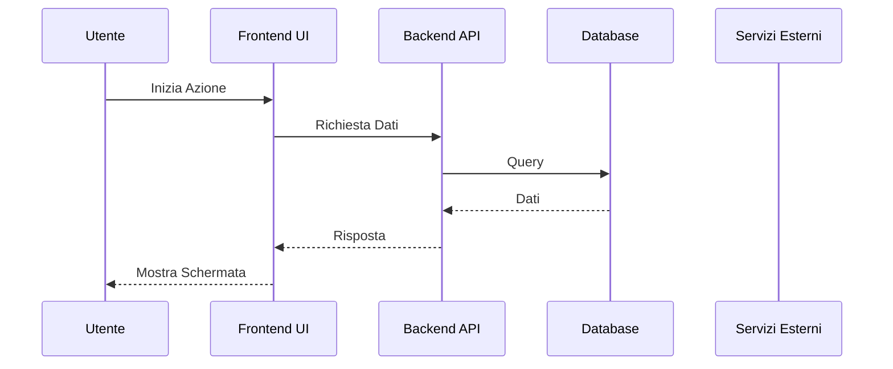

# 🏗️ [Nome Progetto] — Architettura AS-IS (Parte 2)

> **Flussi Avanzati, Integrazioni Esterne, Frontend Architecture**

---

## 6. Flussi Complessi / Integrazioni di Firma

### 6.1 Inizializzazione Flusso
*Spiegare come viene inizializzato il flusso di firma o un flusso equivalente.*



**Payload inviato al Servizio Esterno:**
```json
{
  "transaction_id": "123456",
  "recipient": {
    "email": "user@example.com",
    "name": "Nome Cognome"
  }
}
```

### 6.2 Callback Webhook
*Fornire specifiche sui webhook di callback ricevuti, validazione dell'integrità (HMAC) e gestione asincrona.*

> ⚠️ [NOTE/WARNING] Descrivere requisiti di sicurezza (es. risposta immediata 200, processing asincrono in background).



---

## 7. Pipeline d'Integrazione Transazionali (es. ERP / CRM)

*Spiegare le pipeline di sincronizzazione multi-step verso sistemi esterni.*



### 7.1 Payload Dettagliati Step-by-Step
*Fornire i payload e i verbi HTTP per ciascuno step della pipeline.*

---

## 8. Sincronizzazioni Asincrone (Cron Jobs)

**Schedule:** [es. Ogni giorno alle 05:00 (`0 5 * * *`)]
**Trigger manuale:** [Endpoint del trigger manuale admin]



---

## 9. Admin APIs (`/api/admin`)

> ⚠️ Tutte le route richiedono il ruolo [ADMIN / SUPERUSER]

#### `GET /api/admin/users`
**Response:** Lista utenti con privilegi.

---

## 10. Frontend Architecture

### 10.1 Struttura Pagine & Routing
*Elencare le pagine dell'applicazione con i guard e i layout applicati.*

| Path | Pagina | Guard / Permessi | Layout / UI |
|------|--------|------------------|-------------|
| `/` | Dashboard | AuthGuard | MainLayout |
| `/admin` | Admin Panel | AdminGuard | AdminLayout |

### 10.2 State Management (Zustand/Redux)
*Elencare gli Store globali con il loro scopo specifico.*

| Store | Tecnologia | Scopo |
|-------|-----------|-------|
| `useAuthStore` | Zustand | Stato autenticazione utente |

### 10.3 Data Fetching (React Query / SWR Hooks)
*Elencare gli hook custom di fetching associati alle API.*

| Hook Custom | Endpoint Chiamato | Metodo | Caching / Refetching |
|-------------|-------------------|--------|----------------------|
| `use<Entita>` | `GET /api/<entita>` | GET | Paginated, cache time 5m |

### 10.4 Services Layer (Axios / Fetch Clients)
*Spiegare la configurazione dell'istanza client HTTP (baseURL, interceptors, gestione scadenze token).*

---

## 11. Flusso End-to-End Completo

*Un diagramma di sequenza master che illustra l'intero ciclo di vita di un flusso aziendale (Happy Path).*



---

## 12. External Service Integration Map

*Mappa riassuntiva di tutte le integrazioni con variabili d'ambiente e URL.*

| Servizio | Variabile d'Ambiente URL | Endpoint Utilizzati | Scopo |
|----------|--------------------------|---------------------|-------|
| [Servizio] | `SERVICE_BASE_URL` | `POST /action` | [Scopo] |

---

## 13. Logging & Audit System

*Delineare come vengono salvati i log di sistema per audit tecnici.*

| Tabella Log | Trigger | Stato Master | Tabella Dettaglio associata |
|-------------|---------|--------------|-----------------------------|
| `SyncLog` | Cron / Trigger manuale | SUCCESS / ERROR | `SyncLogDetail` (INFO/ERROR) |

---

## 14. Logiche di Business Critiche (Formule)

*Documentare le formule matematiche o le logiche decisionali implementate nel codice per trasparenza.*

```
Formula di calcolo:
1. Totale = Somma(Prezzi * Quantità)
2. Importo Rata = Totale / Numero Rate
```

---

## 15. Security Summary

*Sintesi dei meccanismi di sicurezza applicati.*

| Aspetto | Dettagli di Implementazione |
|---------|-----------------------------|
| **Autenticazione** | [es. Cookie HttpOnly, JWT] |
| **CORS** | [es. Whitelist da FRONTEND_URL] |
| **Autorizzazione (RBAC)** | [es. Middleware per ruoli ADMIN/AGENT] |
| **Integrità Webhook** | [es. Verifica firma HMAC SHA256] |
| **Validazione Input** | [es. Validazione schemi Zod su parametri e body] |
