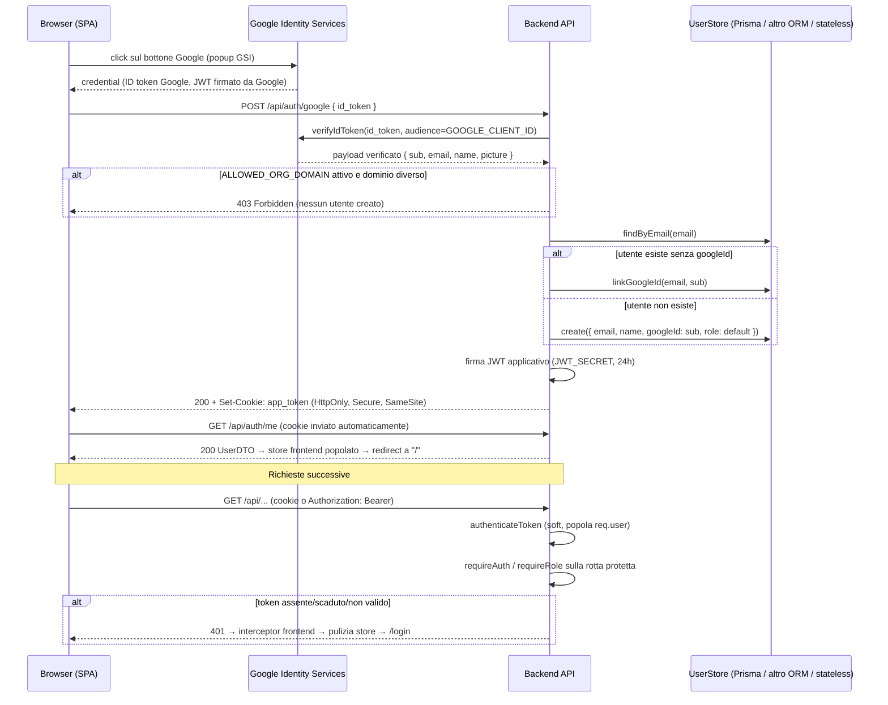

# Architettura del pattern di social login Google

Pattern estratto da un progetto di riferimento in produzione (React + Vite + Zustand / Express + Prisma + MySQL), genericizzato per essere portabile su altri stack.

## Diagramma di sequenza

## Decisioni di design e razionali

**Due token, due responsabilità.** L'ID token Google prova l'identità una sola volta, al login. La sessione applicativa vive in un JWT firmato dal backend: così scadenza, claims (id, email, role, name) e revoca della sessione sono sotto il controllo dell'applicazione, e non si dipende da Google a ogni richiesta.

**Cookie HttpOnly, mai localStorage.** Il token non è leggibile da JavaScript → un XSS non può esfiltrarlo. `secure` in produzione, `sameSite` scelto in base alla topologia delle origin (vedi matrice in `project-analysis.md`). Il middleware accetta anche `Authorization: Bearer` come fallback per client non-browser o scenari cross-origin.

**Middleware a due livelli.** `authenticateToken` è globale e "soft": se il token c'è e valido popola `req.user`, se non c'è lascia passare (le rotte pubbliche devono funzionare); se c'è ma è invalido/scaduto risponde 401 (il client deve ripulire la sessione). La protezione vera è `requireAuth`, applicato per-router/per-rotta: `req.user` assente → 401. `requireRole('ADMIN', ...)` aggiunge l'autorizzazione. **Il guard frontend è solo UX**: senza `requireAuth` le API restano aperte.

**Porta UserStore.** Tutto il codice che tocca la persistenza passa da un'interfaccia con tre metodi (`findByEmail`, `create`, `linkGoogleId`). Il servizio di auth non sa se dietro c'è Prisma, Mongoose o niente: per portare la skill su un nuovo stack si riscrive solo l'adapter.

**Find-or-create per email, aggancio googleId.** L'email è la chiave d'identità: se l'utente esiste già (es. pre-censito da un admin) il primo login Google aggancia il `sub` Google al record esistente invece di duplicarlo.

**Header COOP.** Il popup GSI richiede `Cross-Origin-Opener-Policy: same-origin-allow-popups` sulla pagina che ospita il bottone: senza, il popup non riesce a comunicare il credential alla pagina.

**Restrizione di dominio opzionale, server-side.** `ALLOWED_ORG_DOMAIN` limita il login a un dominio aziendale (es. `example.com`). Va applicata nel backend (il parametro `hd`/hosted domain lato client è solo cosmetico e aggirabile).

## Differenze deliberate rispetto al progetto di riferimento
Il progetto d'origine aveva tre debolezze che questa skill corregge:
1. **Nessun `requireAuth`**: la protezione API era demandata al frontend e a controlli sparsi nei controller. La skill introduce il middleware bloccante.
2. **Restrizione dominio solo nel codice morto**: il check `ALLOWED_ORG_DOMAIN` viveva in una strategia Passport legacy mai invocata. La skill lo porta nel flusso attivo, come opzione.
3. **Dipendenze superflue**: Passport e Firebase Admin non servono a questo pattern e non vanno installati.
